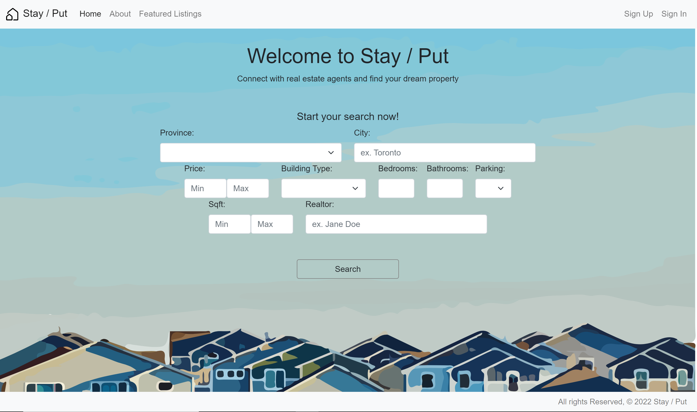

# Stay / Put
## Intro

**Stay / Put** lets renters and buyers quickly connect with realtors to discuss properties for rent/sale! Create a profile, browse as a user, or become an agent and list properties for other users to see.
 
 

    

 

## Technologies Used
This project uses Python, Django, HTML, CSS, JavaScript, Bootstrap5, PostgreSQL, and the google maps API.

## Getting Started  
To check out the app, <a href="https://stay-put.herokuapp.com/" target="_blank">click here!</a>

## Next Steps
- Integrate the google maps api into our search function, giving the user results based on a local radius
- Send emails to the realtor from the webpage itself
- Allow agents to pay to have their listings "featured"
- Have a search result sort that can sort by price, closing date, etc.

